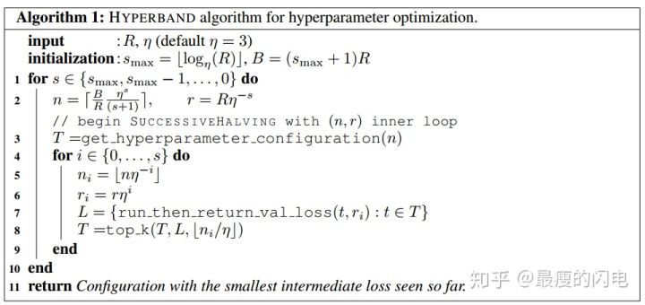

Algorithm of BOHB
===

Pseucode of Hyperband

* r: 单个超参数组合实际所能分配的预算
* R: 单个超参数组合所能分配的最大预算
* s_max: 用来控制总预算的大小。上面算法中smax=⌊logη(R)⌋,当然也可以定义为s_{max}=⌊log_η(n_{max})⌋
* B: 总共的预算,B=(s_max+1)R
* ηη: 用于控制每次迭代后淘汰参数设置的比例
* get_hyperparameter_configuration(n):采样得到n组不同的超参数设置
* run_then_return_val_loss(t,ri):根据指定的参数设置和预算计算valid loss, LL表示在预算为riri的情况下各个超参数设置的验证误差
* topk(T,L,⌊n_i/η⌋):第三个参数表示需要选择top k(k=⌊n_i/η⌋)参数设置

Example

R=81,η=3R 所以smax=4,B=5R=5×81

